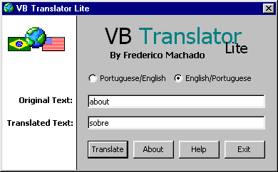



## VB Translator

### Description

That is an example of as we can use a database to keep words of two languages. VB Translator translates from Português(Brasil) to English and from English to Português(Brasil) a word per time.

VOTE FOR ME PLEASEEEEE... :)

LEAVE A FEEDBACK!!!
 
### More Info
 

             |
---                |---
**Submitted On**   |2001-09-08 00:16:10
**By**             |[Frederico Machado](https://github.com/Planet-Source-Code/PSCIndex/blob/master/ByAuthor/frederico-machado.md)
**Level**          |Beginner
**User Rating**    |4.7 (33 globes from 7 users)
**Compatibility**  |VB 6\.0
**Category**       |[Miscellaneous](https://github.com/Planet-Source-Code/PSCIndex/blob/master/ByCategory/miscellaneous__1-1.md)
**World**          |[Visual Basic](https://github.com/Planet-Source-Code/PSCIndex/blob/master/ByWorld/visual-basic.md)
**Archive File**   |[VB Transla26119982001\.zip](https://github.com/Planet-Source-Code/frederico-machado-vb-translator__1-27066/archive/master.zip)

